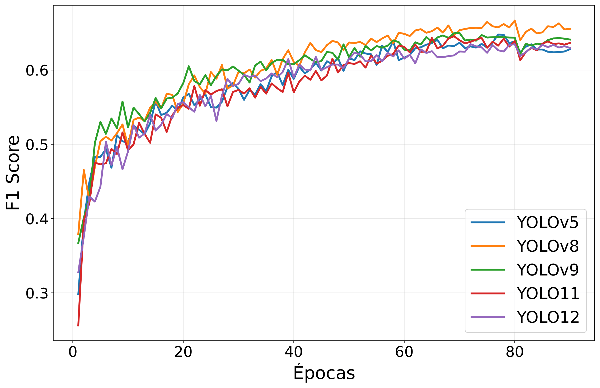

# Vision Models Zoo
## *Zoológico de modelos de visión*

**[EN]**

A curated collection of trained vision models. The available models are:

**[ES]**

Una colección seleccionada de modelos de visión entrenados. Los modelos disponibles son:

### General information
#### Información general

| # | Name / Nombre | Target / Entorno | Formats / Formatos | Models / Modelos | Class / Clases | Description / Descripcion |
|---|---------------|------------------|--------------------|------------------|----------------|----|
| 1 | urbanObjectDetection | - Local Python Script   - Raspberry PI 4 B | `.pt`, NCNN | YOLO5n, YOLO8n, YOLO9t, YOLO11n, YOLO12n | arbol, poste, persona, vehiculo, senializacion, basurero, perro | **[EN]** Detects urban obstacles in La Paz, Bolivia.   **[ES]:** Detecta obstáculos urbanos en La Paz Bolivia. |
| 2 | faceAndPlateDetection | - Local Python Script | `.pt` | YOLO26n | placaAuto, rostro | **[EN]** Detects vehicles plates and faces in Bolivia.   **[ES]:** Detecta placas de vehículos y rostros en Bolivia. |

### Validation metrics
#### Métricas de validación

urbanObjectDetection:

| Models / Modelos | imgSize | Params (M) | Images | Instances | Precission | Recall | mAP@0.50 | mAP@0.50:0.95 | F1-Score |
|------------------|---------|------------|--------|-----------|------------|--------|----------|---------------|----------|
| YOLO5n | 512 | 2,504,309 | 341 | 1989 | 0.752 | 0.566 | 0.632 | 0.376 | 0.656 |
| YOLO8n | 512 | 3,007,013 | 341 | 1989 | 0.748 | 0.601 | 0.661 | 0.404 | 0.666 |
| YOLO9t | 512 | 1,972,149 | 341 | 1989 | 0.755 | 0.570 | 0.643 | 0.394 | 0.649 |
| YOLO11n | 512 | 2,583,517 | 341 | 1989 | 0.726 | 0.571 | 0.635 | 0.391 | 0.639 |
| YOLO12n | 512 | 2,558,093 | 341 | 1989 | 0.720 | 0.567 | 0.632 | 0.376 | 0.634 |

faceAndPlateDetection: 

| Models / Modelos | imgSize | Params (M) | Images | Instances | Precission | Recall | mAP@0.50 | mAP@0.50:0.95 | F1-Score |
|------------------|---------|------------|--------|-----------|------------|--------|----------|---------------|----------|
| YOLO26n | 640 | 2,375,226 | 87 | 224 | 0.706 | 0.613 | 0.649 | 0.28 | 0.656 |

### Test metrics
#### Métricas de pruebas

urbanObjectDetection:

| Models / Modelos | imgSize | Images | Instances | Precission | Recall | mAP@0.50 | mAP@0.50:0.95 | F1-Score |
|------------------|---------|--------|-----------|------------|--------|----------|---------------|----------|
| YOLO5n | 512 | 179 | 985 | 0.701 | 0.545 | 0.592 | 0.358 | 0.613 |
| YOLO8n | 512 | 179 | 985 | 0.733 | 0.554 | 0.599 | 0.366 | 0.631 |
| YOLO9t | 512 | 179 | 985 | 0.700 | 0.578 | 0.626 | 0.380 | 0.633 |
| YOLO11n | 512 | 179 | 985 | 0.716 | 0.567 | 0.618 | 0.368 | 0.633 |
| YOLO12n | 512 | 179 | 985 | 0.700 | 0.539 | 0.605 | 0.363 | 0.609 |

faceAndPlateDetection:

| Models / Modelos | imgSize | Images | Instances | Precission | Recall | mAP@0.50 | mAP@0.50:0.95 | F1-Score |
|------------------|---------|--------|-----------|------------|--------|----------|---------------|----------|
| YOLO26n | 640 | 45 | 121 | 0.827 | 0.482 | 0.563 | 0.256 | 0.609 |

### Performance
#### Rendimiento

urbanObjectDetection:

| Models / Modelos | imgSize | Hardware | Avg. FPS | Avg. Latency / Latemcia (ms) | Avg. RAM (mb) | Avg. %CPU |
|------------------|---------|----------|----------|------------------------------|---------------|-----------|
| YOLO5n | 480 | Raspberry PI 4 B (4 Gb) | 5.47 | 182.95 | 374.25 | 86.17 |
| YOLO8n | 480 | Raspberry PI 4 B (4 Gb) | 5.06 | 198.26 | 408.92 | 89.02 |
| YOLO9t | 480 | Raspberry PI 4 B (4 Gb) | 4.41 | 226.84 | 405.24 | 89.38 |
| YOLO11n | 480 | Raspberry PI 4 B (4 Gb) | 5.05 | 201.25 | 385.09 | 87.85 |
| YOLO12n | 480 | Raspberry PI 4 B (4 Gb) | 3.30 | 303.53 | 391.76 | 83.33 |

